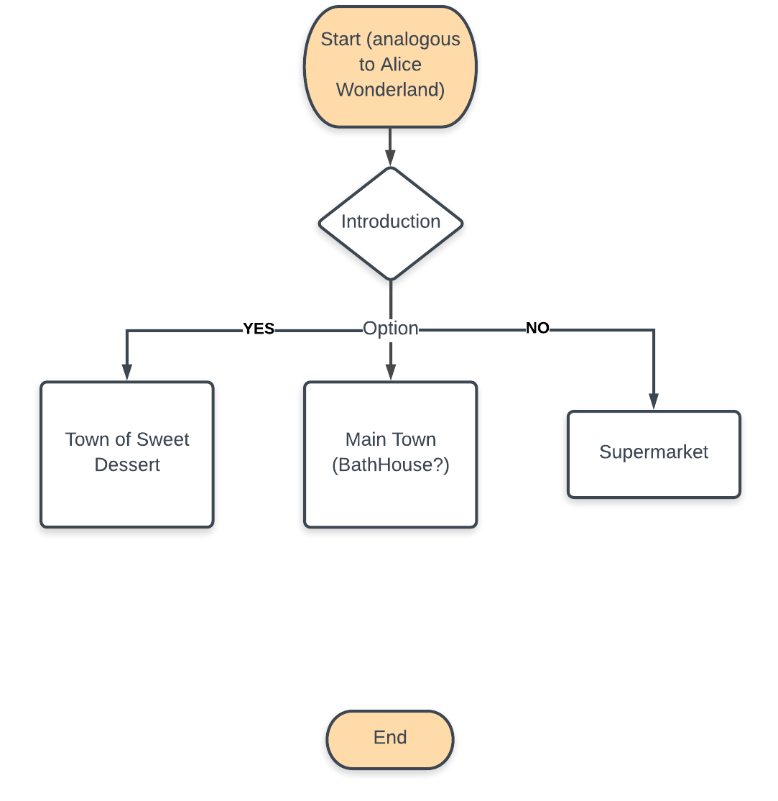

# Cooking Game General Introduction

here will be several lines of bullshittnig indicating the purpose of developing the game, coming soon...

## Plot 1: Faceless Man from 《Spirited Away》

### Macro Game Logic

The part of plot involving Faceless Man from 《Spirited Away》 is basically an iteration of loop consists of several events:

- bringing the Faceless Man to various occasions
- cooking and creating new recipe through task delegations
- feeding the Faceless Man
- getting feedback from the Faceless Man (actually from other users)
- collecting **coins** and **experiences**
- unlocking more recipes creations
- leveling up to explore new plots of adventures

### Game Scenes & Dialogues

- Start Scene (analogous to Alice Wonderland)
	- Dialogue:

- Main Town (**bathhouse** 汤屋?)
	- Dialogue:

- Town of Sweet Desserts
	- Dialogue: 

- Supermarket
	- Dialogue:

### Commentary System

to be decided...

### Game Graphics

#### In Map Scene

- Sprites:

	- Faceless Man: 9-vision sprites
	- Chihiro Ogino (千寻): 9-vision sprites?
	- (Potentially) Haku (白龙): no motions involved, (possibly) static graphic stickers
	- (Potentially) Yubaba (汤婆婆): no motions involved, (possibly) static graphic stickers

In Dialogue Scenes

- Analogous to GalGame...